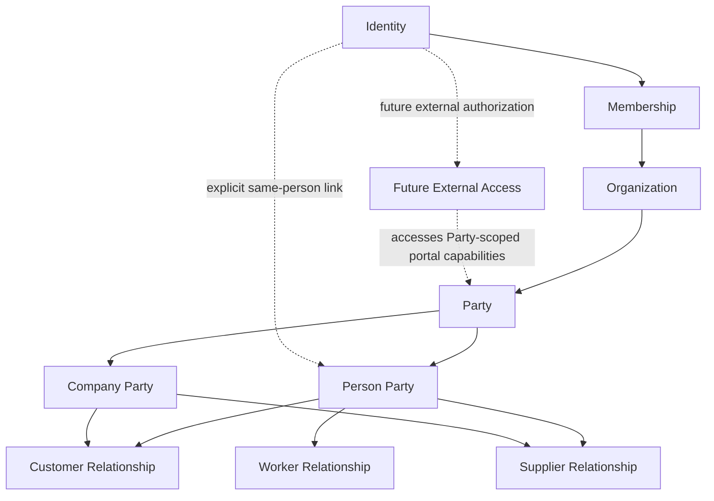

# Manasiness — Identity, Organizations, Memberships, and Parties

> **Status:** Active  
> **Milestone:** M0 — Product & Domain Foundation  
> **Scope:** Manasiness V1  
> **Purpose:** Define the conceptual boundaries between authentication identity, tenant ownership, organization participation, business counterparties, commercial relationships, workforce relationships, and future external access.

---

# 1. Purpose

Identity, organization membership, business identity, and employment are closely related in real life but represent different concepts with different lifecycles.

Manasiness Legacy collapsed several of them together.

A Legacy `store` represented both:

- the business;
- the authenticated account.

A Legacy `user` represented exactly one of:

- customer;
- supplier;
- worker.

That model cannot support the product Manasiness V1 is intended to become.

V1 needs to represent situations such as:

- one person operating several businesses;
- several people operating one business;
- a worker who never logs into Manasiness;
- an authenticated operator who is not a Worker;
- a customer without any application account;
- a supplier without any application account;
- a customer who later receives portal access;
- a Worker who later receives application access;
- one person who is both a customer and supplier;
- one person who is simultaneously a Worker and customer;
- the same real-world person interacting with multiple unrelated Organizations without leaking information between them.

This document establishes the conceptual model that makes those scenarios possible.

It intentionally does not define:

- database tables;
- foreign keys;
- ORM models;
- authentication providers;
- session technology;
- JWT structure;
- OAuth providers;
- password implementation;
- permission matrices;
- API endpoints;
- UI screens.

Those decisions belong to later milestones.

---

# 2. Core separation

The foundational model is:

```text
Identity
    │
    └── Membership
            │
            ▼
      Organization


Organization
    │
    └── Party
         ├── Customer Relationship
         ├── Supplier Relationship
         └── Worker Relationship
```

When the same real person both uses Manasiness and participates in the business:

```text
Identity
    │
    ├── Membership ──────────► Organization
    │                              │
    │                              ▼
    └── optional link ───────► Person Party
                                   │
                                   ├── Customer Relationship
                                   ├── Supplier Relationship
                                   └── Worker Relationship
```

These concepts may describe the same human being.

They are not the same domain entity.

---

# 3. The five fundamental questions

The model deliberately gives different concepts responsibility for different questions.

## Identity

Answers:

> Who is authenticating?

## Organization

Answers:

> Which business exists inside Manasiness?

## Membership

Answers:

> May this Identity participate in this Organization's internal workspace?

## Party

Answers:

> Which real person or company does this Organization know and maintain a business relationship with?

## Business Relationship

Answers:

> In what capacity does this Party interact with this Organization?

Examples:

```text
Customer
Supplier
Worker
```

This separation is fundamental.

---

# 4. Identity

An **Identity** represents a human principal capable of authenticating into Manasiness.

Conceptually, Identity is global to the Manasiness platform rather than owned by one Organization.

An Identity may eventually participate in multiple Organizations.

Example:

```text
Identity: María
│
├── Membership → Organization A
├── Membership → Organization B
└── Membership → Organization C
```

María does not need three authentication accounts.

---

# 5. What Identity owns conceptually

Identity may carry information required for platform authentication and account-level security.

Conceptually this may include concerns such as:

- authentication identity;
- verified authentication addresses;
- credentials or external authentication linkage;
- account security;
- account recovery;
- global account lifecycle.

The precise representation is deferred to M3.

---

# 6. What Identity does not mean

Having an Identity does not mean that the person is:

- a customer;
- a supplier;
- a Worker;
- an employee;
- an Organization owner;
- an administrator;
- a Member of every Organization;
- entitled to access business information.

Identity answers only:

> Who can authenticate as this principal?

All access to Organization-scoped functionality requires additional authorization context.

---

# 7. Shared accounts are not part of the conceptual model

An Identity represents an individual authentication principal.

Manasiness should not intentionally model:

```text
"Store Account"
```

whose credentials are shared by several people.

That pattern would destroy:

- attribution;
- individual authorization;
- revocation;
- meaningful audit trails;
- secure account recovery.

Multiple people operating the same Organization should have separate Identities and separate Memberships.

---

# 8. Organization

An **Organization** represents a business operating within Manasiness.

Organization is the primary tenant boundary.

Examples could include:

```text
Bodega Central
Distribuidora Vega
Minimarket San José
```

An Organization is independent from whichever Identity originally created it.

---

# 9. Organization is not an account

The Organization itself does not authenticate.

This is explicitly rejected:

```text
Organization
├── email
└── password
```

as the authentication model.

Instead:

```text
Identity
    │
Membership
    │
Organization
```

This separation allows an Organization to survive changes such as:

- owner transfer;
- administrator replacement;
- worker turnover;
- credential changes;
- multiple simultaneous operators.

---

# 10. Organization ownership is authorization, not identity

A business may have an owner in product terms.

That ownership should conceptually be expressed through the Identity's relationship with the Organization, not through authentication credentials stored on the Organization itself.

Conceptually:

```text
Identity
    │
Membership
    │
Authorization capability: owner
    │
Organization
```

The precise authorization-role model is intentionally deferred.

The important rule is:

> Organization ownership must be transferable without replacing the Organization or rewriting its historical business data.

---

# 11. Organization as tenant boundary

Unless another domain explicitly states otherwise, business information belongs to exactly one Organization.

Examples include:

```text
Party
Customer Relationship
Supplier Relationship
Worker Relationship
Product
Inventory
Sale
Purchase
Receivable
Payable
Expense
Report
```

This gives every operational record an unambiguous business context.

---

# 12. Cross-Organization isolation

Organization A and Organization B are separate tenants.

Information belonging to one must not implicitly become visible to the other.

Conceptually:

```text
Organization A
└── Party: Juan Pérez

Organization B
└── Party: Juan Pérez
```

These may refer to the same real-world person.

They are still separate Organization-owned business records.

Organization A must not gain access to Organization B's relationship history merely because:

- names match;
- emails match;
- phone numbers match;
- both Parties eventually link to the same global Identity.

---

# 13. No global Party directory

Manasiness V1 does not treat Parties as a global shared customer/supplier database.

Party records are Organization-scoped.

This prevents:

- accidental tenant leakage;
- one business controlling another business's customer data;
- unexpected updates across Organizations;
- ambiguous ownership of contact information;
- privacy problems caused by global deduplication.

Therefore this is intentionally valid:

```text
Organization A
└── Party #A123
    └── Juan Pérez

Organization B
└── Party #B982
    └── Juan Pérez
```

even if both represent the same human.

---

# 14. Membership

A **Membership** represents an Identity's internal participation in an Organization.

Conceptually:

```text
Identity + Organization = Membership
```

Membership establishes the context needed for internal Organization access.

It answers questions such as:

- Does this Identity belong to this Organization workspace?
- Is this participation active?
- Which authorization capabilities apply inside this Organization?
- May this Identity perform this operation here?

---

# 15. Membership is not employment

This invariant is fundamental:

```text
Membership ≠ Worker Relationship
```

Examples:

### Owner who does not need a Worker record

```text
Identity
└── Membership → Organization

No Worker Relationship required.
```

### External accountant or administrator

```text
Identity
└── Membership → Organization

No Worker Relationship required.
```

### Worker without application access

```text
Person Party
└── Worker Relationship

No Identity required.
No Membership required.
```

### Worker with Manasiness access

```text
Identity
└── Membership

Person Party
└── Worker Relationship
```

Both structures exist and may be explicitly linked.

---

# 16. Membership is Organization-scoped

An Identity's access in one Organization says nothing about its access in another.

Example:

```text
Identity: María
│
├── Organization A
│   └── Administrator capabilities
│
└── Organization B
    └── Sales capabilities
```

Authorization is evaluated in Organization context.

There is no assumption that permissions transfer between Organizations.

---

# 17. Membership lifecycle

Membership has its own lifecycle independent from Identity and Worker Relationship.

For example, a Membership may eventually become:

- invited;
- active;
- suspended;
- ended.

The exact states belong to M3.

The conceptual invariant is:

> Ending Organization access must not delete the Identity, Worker Relationship, Party, or historical operations attributed to that Identity.

---

# 18. Party

A **Party** represents a real person or external company that an Organization needs to recognize persistently for business purposes.

Party provides stable business identity.

A Party exists because the Organization needs to answer:

> Who is this real-world person or company in our business context?

Examples:

```text
Juan Pérez
Distribuidora Lima S.A.C.
María Torres
Proveedor Industrial S.R.L.
```

---

# 19. Party ownership

Every Party belongs to one Organization.

Conceptually:

```text
Organization
└── Party
```

not:

```text
Global Party
├── Organization A
└── Organization B
```

This decision deliberately favors tenant ownership and isolation.

---

# 20. Party is not Identity

A Party does not need authentication access.

This is normal:

```text
Party: Juan Pérez
└── Customer Relationship

Identity: none
```

Likewise:

```text
Party: Proveedor Industrial S.A.C.
└── Supplier Relationship

Identity: none
```

Most business counterparties may never need to authenticate into Manasiness.

---

# 21. Person Party

A **Person Party** represents a natural person.

A Person Party may participate in relationships such as:

```text
Customer
Supplier
Worker
```

individually or simultaneously where real business behavior requires it.

---

# 22. Company Party

A **Company Party** represents an external company, institution, supplier business, corporate customer, or other organizational counterparty.

It must not be confused with a Manasiness `Organization`.

Example:

```text
Manasiness Organization
└── Bodega Central

Party
└── Distribuidora Gloria S.A.C.
    └── Supplier Relationship
```

`Bodega Central` is the tenant.

`Distribuidora Gloria S.A.C.` is a counterparty known by that tenant.

---

# 23. A Company Party does not authenticate

A company is not itself a human authentication principal.

Future company-facing portal access should be given to individual Identities authorized to act for that company.

Conceptually:

```text
Company Party
└── represented by / associated with authorized people

Identity: María
└── external portal access
```

rather than:

```text
Company Party
└── password
```

The exact representation of company contacts or representatives is intentionally deferred.

---

# 24. Business relationships

Party identity and business relationship are separate concepts.

A Party answers:

> Who is this?

A Relationship answers:

> In what business capacity does this Party interact with this Organization?

The initial relevant relationships are:

```text
Customer Relationship
Supplier Relationship
Worker Relationship
```

---

# 25. Customer Relationship

A **Customer Relationship** expresses that the Organization recognizes a Party as a customer worth tracking persistently.

This relationship may support future capabilities such as:

- identifiable Sale history;
- Receivables;
- customer contact information;
- customer notes;
- recurring commercial activity;
- credit policy;
- customer portal access.

The detailed customer profile belongs to M4.

---

# 26. Customer Relationship is optional for a Sale

Not every buyer needs a Customer Relationship.

An ordinary anonymous/casual Sale is valid:

```text
Sale
└── customer: absent
```

Manasiness must not create:

```text
Unknown Customer
```

or any equivalent synthetic Party.

Absence is legitimate data when the business does not know or need to persist the customer's identity.

---

# 27. When a customer should become a Party

A persistent Party/Customer Relationship is appropriate when the Organization needs continuity.

Examples include:

- customer purchases on credit;
- customer has an outstanding Receivable;
- customer makes recurring orders;
- customer history matters;
- customer provides contact information worth retaining;
- customer needs future portal access;
- the Organization explicitly chooses to track the relationship.

A routine walk-in Sale does not require this.

---

# 28. Supplier Relationship

A **Supplier Relationship** expresses that the Organization recognizes a Party as a supplier.

It may support:

- Purchase history;
- Payable history;
- supplier contact information;
- commercial terms;
- recurring acquisition history;
- future supplier portal access.

Purchasing references this relationship but does not own it.

---

# 29. Worker Relationship

A **Worker Relationship** represents the operational/employment relationship between a Person Party and an Organization.

A Worker Relationship must refer to a Person Party.

A Company Party cannot itself be a Worker.

A Worker Relationship may exist without:

- Identity;
- Membership;
- login access.

This is expected behavior.

---

# 30. Multi-relationship Parties

A Party may simultaneously participate in several relationships when reality requires it.

This is valid:

```text
Party: Juan Pérez
│
├── Customer Relationship
├── Supplier Relationship
└── Worker Relationship
```

Manasiness must not force Juan into exactly one category.

This directly replaces the Legacy model:

```text
role = customer | supplier | worker
```

---

# 31. Relationships have independent lifecycles

Ending one relationship must not automatically end the others.

Example:

```text
Party: Juan Pérez
│
├── Customer Relationship → active
└── Supplier Relationship → ended
```

Juan remains the same Party.

His Customer history remains valid.

His historical Supplier activity remains valid.

Only the current Supplier Relationship has ended.

---

# 32. Party survives relationship changes

A Party should not disappear merely because one relationship ends.

Conceptually:

```text
Party
├── historical Customer Relationship
└── historical Supplier Relationship
```

may remain valuable long after neither relationship is currently active.

Historical business references must remain understandable.

Detailed deletion and archival rules belong to Issue #5.

---

# 33. Relationship creation does not create Identity

Creating a:

- Customer;
- Supplier;
- Worker;

must not automatically create an authentication account.

This avoids unnecessary:

- credentials;
- emails;
- invitations;
- security exposure;
- fake accounts.

Authentication is introduced only when a real product capability requires application access.

---

# 34. Identity-to-Party link

Sometimes an authenticated Identity and a Person Party represent the same real-world human.

Manasiness should be able to express that explicitly.

Conceptually:

```text
Identity
    │
    │ represents same real person
    ▼
Person Party
```

This linkage is optional.

---

# 35. Identity-to-Party linking is Organization-scoped

The meaning of an Identity-to-Party association exists within a particular Organization context.

Example:

```text
Identity: Sebastián
│
├── Organization A
│   └── linked Person Party: Sebastián
│       └── Worker Relationship
│
└── Organization B
    └── no Party link
```

The global Identity does not automatically become a Party in every Organization it can access.

---

# 36. Linking must be explicit

Manasiness must not silently decide that an Identity and Party represent the same person solely because:

- email addresses match;
- phone numbers match;
- names match.

Those signals may eventually assist an operator.

They must not silently merge or connect records.

The link must be explicit and authorized.

This prevents incorrect identity association and cross-tenant data leakage.

---

# 37. Person Party linking cardinality

Within one Organization, the intended conceptual model is:

> One Identity represents at most one Person Party for that Organization.

and:

> One Person Party may be linked to at most one Identity as that person's direct Manasiness account.

This represents the real-world rule that one person's account should correspond to that person, not to several unrelated business identities.

The eventual persistence constraints are deferred.

---

# 38. Company Parties and Identity linking

A Company Party should not be directly treated as the Identity of a company.

Humans authenticate.

Therefore future external access for a company should conceptually resemble:

```text
Company Party
└── authorized representative(s)
        │
        ▼
     Identity
```

rather than:

```text
Company Party = Identity
```

The detailed representative/contact model is outside this issue.

---

# 39. Worker receiving internal application access

Suppose a Worker initially exists only as:

```text
Person Party: Ana
└── Worker Relationship
```

Later Ana must use Manasiness.

The Organization should be able to add:

```text
Identity: Ana
└── Membership → Organization
```

and explicitly link that Identity to Ana's existing Person Party.

The existing Worker Relationship and history remain unchanged.

No replacement Worker record should be created.

---

# 40. Removing a Worker's access

The reverse must also be possible.

If Ana stops needing Manasiness access:

```text
Membership → ended/suspended
```

This does not necessarily mean:

```text
Worker Relationship → ended
```

Ana may still work for the business.

Likewise, if Ana leaves employment:

```text
Worker Relationship → ended
```

this does not necessarily imply the same lifecycle action on Membership.

The business may intentionally decide access separately.

---

# 41. Customer receiving portal access

Suppose Juan already exists as:

```text
Person Party: Juan
└── Customer Relationship
```

with:

- Sale history;
- Receivables;
- Payments.

Later Manasiness introduces a customer portal.

The correct evolution is:

```text
Identity: Juan
       │
       ▼
explicit link
       │
       ▼
Person Party: Juan
└── existing Customer Relationship
```

The original customer history remains attached to the same Party.

No duplicate customer should be created.

---

# 42. Portal access is not Membership

This distinction is critical.

An Organization `Membership` represents participation in the Organization's **internal workspace**.

A customer using a customer portal should not automatically become an internal Member.

Similarly, a supplier portal user should not automatically receive internal Organization access.

Conceptually:

```text
Internal access
Identity
└── Membership
    └── Organization workspace
```

versus:

```text
External access
Identity
└── linked Party / authorized external relationship
    └── limited portal capabilities
```

The exact external-access authorization model is deliberately deferred.

The boundary is not.

---

# 43. Future supplier portal

The same principle applies to suppliers.

Existing:

```text
Party
└── Supplier Relationship
    ├── Purchase history
    └── Payable history
```

Future:

```text
Identity
└── authorized external access
        │
        ▼
existing Party / Supplier context
```

The Supplier Relationship should not be recreated merely to add login capability.

---

# 44. Identity does not own Party data

An authenticated person linked to a Party does not automatically become the owner of all Party information.

Party information belongs to the Organization's business context.

For example:

```text
Customer notes
credit information
internal classifications
supplier history
worker operational records
```

may not all be visible through future external portals.

Authentication linkage establishes identity.

Authorization still decides what information can be accessed.

---

# 45. Party does not own authentication data

Likewise, Party should not contain authentication concerns such as:

- password hash;
- session;
- login token;
- password reset token;
- authentication provider;
- MFA configuration.

Those belong to Identity & Access.

This prevents deleting or modifying a Party from accidentally becoming an account-security operation.

---

# 46. Contact information versus login identity

A Party may contain a contact email such as:

```text
ventas@proveedor.com
```

That does not mean:

```text
ventas@proveedor.com
```

is automatically an authentication Identity.

Similarly, an Identity's verified login email may differ from the contact email an Organization stores for the corresponding Party.

Contact information and authentication identifiers have different ownership and trust semantics.

---

# 47. Organization-specific Party information

Different Organizations may legitimately know different information about the same real-world person.

Example:

```text
Organization A
└── Juan
    ├── phone: X
    ├── customer notes
    └── credit history

Organization B
└── Juan
    ├── phone: Y
    ├── supplier notes
    └── purchase history
```

Even if both Parties are linked to the same global Identity in the future, these Organization-owned records remain isolated.

---

# 48. No cross-tenant Party synchronization by default

Updating Party information in Organization A must not silently modify Organization B's Party record.

Any future capability that shares user-controlled information across Organizations would require a deliberate product and privacy model.

It is not part of V1.

---

# 49. Anonymous and identified interaction boundary

Manasiness distinguishes:

```text
anonymous business interaction
```

from:

```text
identified Party relationship
```

Anonymous is appropriate when persistence of the counterparty is unnecessary.

Identified Party is appropriate when relationship continuity matters.

Neither is inherently more "complete."

They solve different business needs.

---

# 50. Anonymous Sale example

Valid:

```text
Organization
└── Sale
    ├── Customer: absent
    ├── Sale Items
    └── financial settlement
```

Invalid workaround:

```text
Organization
└── Party: Unknown Customer
    └── Customer Relationship
        └── Sale
```

The second model invents a real-world entity that does not exist.

---

# 51. Identified credit Sale example

```text
Organization
│
├── Party: Juan Pérez
│   └── Customer Relationship
│
└── Sale
    └── Customer → Juan Pérez
            │
            ▼
         Finance
         └── Receivable
```

Persistent identification is necessary because an outstanding obligation must remain attributable.

---

# 52. Supplier example

```text
Organization: Bodega Central
│
├── Party: Distribuidora Lima S.A.C.
│   └── Supplier Relationship
│
└── Purchase
    └── Supplier → Distribuidora Lima S.A.C.
```

The Supplier Relationship provides continuity across Purchases.

---

# 53. Worker example

```text
Organization
│
├── Party: María Torres
│   └── Worker Relationship
│
└── historical operations involving María
```

María does not require:

```text
Identity
Membership
```

until there is an actual need for application access.

---

# 54. Multi-role example

A shop owner may buy products from an individual who also shops at the business.

Correct:

```text
Party: Carlos
├── Customer Relationship
└── Supplier Relationship
```

Incorrect:

```text
Customer Carlos
Supplier Carlos
```

as two unrelated identities solely because the Legacy role model requires one role per record.

---

# 55. Worker + customer example

A Worker may also buy from the business personally.

Correct:

```text
Party: Ana
├── Worker Relationship
└── Customer Relationship
```

Her employee history and customer history have different business meaning while sharing stable Party identity.

---

# 56. Identity + Worker + Member example

When Ana also operates Manasiness:

```text
Identity: Ana
│
└── Membership
    └── Organization

explicit same-person link

Person Party: Ana
└── Worker Relationship
```

Authorization responsibilities remain under Identity/Membership.

Employment responsibilities remain under Worker Relationship.

---

# 57. Tenant isolation model

The high-level ownership model is:

```text
Manasiness Platform
│
├── Identity A
├── Identity B
├── Identity C
│
├── Organization A
│   ├── Memberships
│   ├── Parties
│   │   ├── Customer Relationships
│   │   ├── Supplier Relationships
│   │   └── Worker Relationships
│   ├── Catalog
│   ├── Inventory
│   ├── Sales
│   ├── Purchasing
│   └── Finance
│
└── Organization B
    ├── Memberships
    ├── Parties
    ├── Catalog
    ├── Inventory
    ├── Sales
    ├── Purchasing
    └── Finance
```

Identity exists at platform level.

Membership provides Organization context.

Business information remains Organization-owned.

---

# 58. Authorization context

Every internal Organization operation should conceptually have enough context to answer:

```text
Which Identity is acting?
Which Organization are they acting in?
Which Membership authorizes them?
Which capability are they attempting?
```

The exact permission system belongs to M3.

This issue establishes only that authorization cannot be derived from business relationships such as:

```text
Worker
Customer
Supplier
```

---

# 59. Worker Relationship must not grant permissions

This is invalid reasoning:

```text
Party has Worker Relationship
therefore
Party may access internal Manasiness
```

A Worker has application access only if a corresponding Identity has an appropriate Membership.

---

# 60. Membership must not create Worker history

Likewise:

```text
Identity has Membership
```

must not automatically create:

```text
Worker Relationship
```

An accountant, owner, external administrator, consultant, or future automation operator may legitimately participate in the Organization without being an employee.

---

# 61. Customer/Supplier Relationship must not grant internal access

A Party becoming a Customer or Supplier does not create Membership.

External portal access, if introduced, uses a separate external authorization model.

This is essential to prevent customer accounts from gaining internal workspace privileges.

---

# 62. Historical identity

Business history should remain attached to the stable Party even when descriptive information changes.

For example:

```text
Party:
Juan Pérez
```

may later update:

```text
phone number
email
display name
contact address
```

Historical Sales should remain attributable to the same Party.

The Party's current mutable information and historical transaction snapshots are separate concerns.

---

# 63. Relationship history

Ending a Customer, Supplier, or Worker Relationship must not erase historical references.

Example:

```text
Supplier Relationship
active 2026–2028
ended 2028
```

Purchases from 2027 remain attributable.

Likewise:

```text
Worker Relationship
ended
```

does not remove historical actions or worker-related financial records.

---

# 64. Party merging

Duplicate Parties may eventually occur in real business operation.

For example:

```text
Juan Perez
Juan Pérez
```

might accidentally represent the same person.

This issue deliberately does not define a Party merge operation.

Merging business identities can have serious historical consequences and should be designed explicitly if required.

V1 must not silently merge Parties based on similarity.

---

# 65. Party splitting

Likewise, incorrectly combining two people into one Party may require future correction.

No generic split behavior is specified here.

The important M0 principle is:

> Identity correction must preserve historical traceability rather than silently rewriting business history.

Detailed correction policies belong to later domain work if needed.

---

# 66. Organization lifecycle

Organization lifecycle is independent from Identity lifecycle.

Deleting or disabling an Identity must not implicitly delete the Organization.

Likewise, Organization closure must not imply deletion of every participating Identity.

This separation makes ownership transfer and long-lived business records possible.

Detailed Organization retention/deletion policy belongs to Issue #5.

---

# 67. Identity lifecycle

Identity lifecycle is platform-level.

An Identity may lose access to one Organization while continuing to access another.

Example:

```text
Identity
├── Membership A → ended
└── Membership B → active
```

The Identity itself remains valid.

---

# 68. Relationship lifecycle

Each business relationship has its own lifecycle.

Conceptually:

```text
Party
├── Customer Relationship
│   └── lifecycle
│
├── Supplier Relationship
│   └── lifecycle
│
└── Worker Relationship
    └── lifecycle
```

One lifecycle must not drive the others automatically.

---

# 69. Conceptual invariants

The following invariants are foundational for Manasiness V1.

### Identity

- Identity represents authentication, not business role.
- Identity may participate in multiple Organizations.
- Identity is not owned by a single Organization.
- shared Organization credentials are not the intended access model.

### Organization

- Organization represents the business tenant.
- Organization does not authenticate.
- operational business data has explicit Organization ownership.
- ownership of an Organization is expressed through authorization context rather than Organization credentials.

### Membership

- Membership connects Identity and Organization.
- Membership represents internal Organization participation.
- Membership is not employment.
- Membership permissions are Organization-scoped.
- ending Membership does not erase historical attribution.

### Party

- Party is Organization-scoped.
- Party represents a real person or company.
- Party does not require authentication.
- Party is not globally shared between Organizations.
- Party may survive changes to all of its current Relationships.

### Relationships

- Customer, Supplier, and Worker are relationships, not Identity roles.
- one Party may hold multiple Relationships.
- Relationship lifecycles are independent.
- ending one Relationship does not erase Party identity or history.

### Worker

- Worker Relationship requires a Person Party.
- Worker does not require Identity.
- Worker does not require Membership.
- Identity/Membership does not imply Worker.

### External access

- future customer/supplier access links authentication to existing business identity.
- external portal access must not automatically create internal Membership.
- linking is explicit rather than inferred from matching contact fields.

### Anonymous interactions

- anonymous/casual Sales do not require a Party.
- synthetic `Unknown Customer` records are prohibited as a modeling workaround.

### Tenant isolation

- matching real-world identity does not merge tenant-owned Party data.
- Party information from one Organization must not leak into another.
- global Identity linkage must not weaken Organization isolation.

---

# 70. Conceptual diagram



Important interpretations:

- `Identity → Membership → Organization` represents internal access.
- `Organization → Party` represents tenant ownership.
- Person and Company are Party forms.
- Customer/Supplier/Worker are relationships.
- Worker applies to Person Party.
- Identity-to-Person-Party linking is optional and explicit.
- external portal access is deliberately separate from Membership.

---

# 71. Scenario matrix

| Scenario | Identity | Membership | Party | Relationship |
|---|---:|---:|---:|---|
| anonymous buyer | no | no | no | none |
| tracked customer | optional | no | yes | Customer |
| customer with future portal | yes | no internal Membership required | yes | Customer |
| supplier company | no | no | yes | Supplier |
| supplier representative with future portal | yes | no internal Membership required | yes / representative context | Supplier |
| Worker without application access | no | no | yes | Worker |
| Worker with internal access | yes | yes | yes | Worker |
| Organization owner/operator | yes | yes | optional Party | optional Worker |
| external accountant | yes | yes | optional Party | no Worker required |
| customer + supplier | optional | no by default | one Party | Customer + Supplier |
| Worker + customer | optional | only if internal access required | one Party | Worker + Customer |

This matrix demonstrates that authentication, authorization, and business relationships remain independent.

---

# 72. Relationship to Sales

Sales may reference:

```text
Customer Relationship
```

when the buyer is known.

Sales may also have:

```text
Customer Relationship: absent
```

for anonymous Sales.

Sales must not own Party identity.

Sales must not create synthetic Parties merely to satisfy persistence.

---

# 73. Relationship to Purchasing

Purchasing references a Supplier Relationship.

Purchasing must not redefine the Supplier's identity.

Supplier commercial history remains associated with the stable Party/Relationship.

Whether exceptional purchasing without an identified Supplier is allowed belongs to Issue #9.

---

# 74. Relationship to Workforce

Workforce owns Worker Relationship.

Parties owns the Person Party.

Identity & Access owns authentication.

Organizations owns Membership.

Therefore:

```text
same real person
```

may legitimately span several domains without being collapsed into one entity.

---

# 75. Relationship to Finance

Finance may reference Parties when financial obligations must remain attributable.

Examples:

```text
Receivable → Customer Party context
Payable → Supplier Party context
```

Finance does not own Party identity.

Likewise, having an outstanding Receivable does not convert a Party into an authentication account.

---

# 76. Relationship to Operational Assistant

The Assistant may resolve phrases such as:

```text
"Juan"
```

to an Organization-scoped Party.

Entity Resolution must operate within the active Organization context.

It must not search another tenant's Parties merely because a global Identity exists.

If multiple Parties match:

```text
Juan Pérez
Juan Torres
```

the Assistant should clarify rather than guess when the operation is consequential.

---

# 77. Relationship to Reporting

Reporting may aggregate information around:

- Customer Relationships;
- Suppliers;
- Workers;
- Members;
- Identities as Actors.

Reporting must preserve the distinctions defined here.

For example:

```text
sales by Worker
```

and:

```text
actions by authenticated Actor
```

are not automatically the same metric.

---

# 78. Legacy concepts explicitly rejected

The following models must not return.

## Store as account

```text
Store
├── business information
├── email
└── password
```

Replaced by:

```text
Identity → Membership → Organization
```

## User as business counterparty

```text
User
└── role = customer | supplier | worker
```

Replaced by:

```text
Party
├── Customer Relationship
├── Supplier Relationship
└── Worker Relationship
```

## One immutable role

Removed.

Relationships may coexist.

## Unknown Customer

Removed.

Anonymous Sale represents legitimate absence.

## Worker equals account

Removed.

Worker and authentication are independent.

---

# 79. Decisions intentionally deferred

This issue establishes conceptual boundaries.

It intentionally leaves the following for later milestones.

## M3 — Identity, Organizations & Access Control

Will define implementation-level concerns such as:

- authentication mechanism;
- Session implementation;
- invitations;
- Membership states;
- authorization model;
- permission model;
- Organization switching;
- account recovery;
- Identity security.

## M4 — Parties & Business Relationships

Will define implementation-level Party capabilities such as:

- Party creation/editing;
- Person vs Company representation;
- contacts;
- customer/supplier profiles;
- search;
- duplicate handling policy where required;
- lifecycle behavior.

## M9 — Workforce

Will refine:

- Worker Relationship lifecycle;
- employment information;
- worker operational fields;
- Worker/Identity linking workflows;
- supported worker-related Finance behavior.

## Future portal milestones

May define:

- customer portal access;
- supplier portal access;
- company representatives;
- external authorization;
- invitations;
- portal-visible data.

These future capabilities must preserve the boundaries established here.

---

# 80. Non-goals

This document deliberately does not define:

- concrete database schema;
- entity IDs;
- indexes;
- foreign keys;
- ORM relations;
- PostgreSQL RLS;
- authentication protocol;
- password policies;
- JWT claims;
- session storage;
- OAuth;
- RBAC versus ABAC implementation;
- detailed permission matrices;
- API contracts;
- invitation UI;
- Party CRUD screens;
- portal screens;
- customer credit rules;
- worker payroll rules.

Those are later decisions.

---

# 81. Decision summary

The V1 model is based on four independent axes.

## Authentication

```text
Identity
```

Who can authenticate?

## Internal participation

```text
Membership
```

In which Organization may that Identity operate internally?

## Business identity

```text
Party
```

Which real person or company does the Organization know?

## Business relationship

```text
Customer
Supplier
Worker
```

How does that Party interact with the Organization?

These axes may connect where reality requires it.

They must not be collapsed for implementation convenience.

---

# 82. Final model

The conceptual boundary can be summarized as:

```text
PLATFORM IDENTITY
────────────────────────────────────

Identity
│
├── Membership ──────────────► Organization A
│
└── Membership ──────────────► Organization B


ORGANIZATION A BUSINESS CONTEXT
────────────────────────────────────

Organization A
│
├── Party: Juan
│   ├── Customer Relationship
│   └── Supplier Relationship
│
├── Party: Ana
│   └── Worker Relationship
│
└── Party: Distribuidora X
    └── Supplier Relationship


OPTIONAL SAME-PERSON LINK
────────────────────────────────────

Identity: Ana
      │
      └──── explicit link ────► Person Party: Ana
                                  └── Worker Relationship


FUTURE EXTERNAL ACCESS
────────────────────────────────────

Identity: Juan
      │
      └──── explicit link ────► Person Party: Juan
                                  └── Customer Relationship

Portal access ≠ internal Membership
```

The central rule is:

> **Authentication describes who can access Manasiness. Organization Membership describes internal participation. Party describes who the business knows. Customer, Supplier, and Worker describe why the business knows them.**

Those concepts may represent aspects of the same human being, but they must remain independently modeled because they have different ownership, security requirements, and lifecycles.